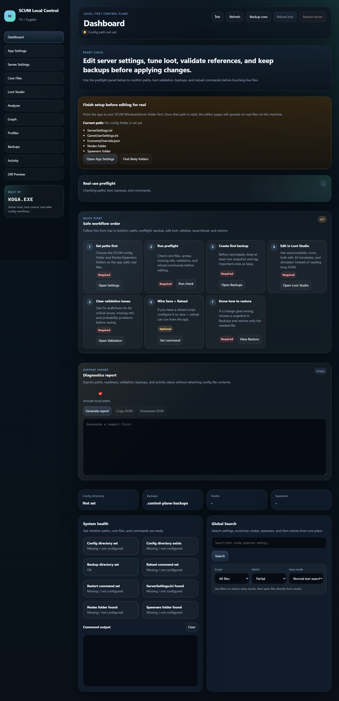

# SETTING SERVER SCUM

Current local-ready level: `P2.12`. This is the final local polish pass: Loot Studio has clear Builder / Split / Raw editor modes, long-list workbenches, item catalog/icon support, safer copy checks, shareable file links, and Analyzer/Search can open the exact loot file that needs work.

Portable launcher update: for a shared/local build, run `npm run package:portable`, open `dist/SETTING-SERVER-SCUM-local`, then double-click `Start SETTING SERVER SCUM.cmd`. The launcher checks Node.js, installs missing runtime dependencies, finds a free port, starts the local server, writes `logs/startup.log`, and opens the browser automatically.

Latest packaged release notes: `docs/releases/v1.0.1-local.md`

เครื่องมือเว็บสำหรับคนดูแลเซิร์ฟเวอร์ SCUM ที่ไม่อยากนั่งไล่แก้ `INI` / `JSON` ดิบๆ แล้วลุ้นว่าเซิร์ฟจะพังไหมตอนกด save

โปรเจกต์นี้ทำมาเพื่อช่วยจัดการไฟล์ตั้งค่า, loot, Nodes, Spawners, backup, profile และ validation ในที่เดียว เปิดใช้งานแบบ local บนเครื่องของคุณเอง ไฟล์เซิร์ฟเวอร์ยังอยู่ในเครื่องคุณ ไม่ได้ส่งขึ้นเว็บนอก



## ลิงก์เริ่มต้น

- ถ้าเพิ่งโหลดมาใหม่ อ่านอันนี้ก่อน: `docs/INSTALL_TH.md`
- ถ้าติดตั้งแล้วและอยากรู้ว่าแต่ละหน้าทำอะไร: `docs/USAGE_GUIDE.md`
- ถ้าจะส่งต่อหรือปล่อยเวอร์ชันใหม่: `docs/RELEASE_CHECKLIST.md`

## ตอนนี้ทำอะไรได้บ้าง

ตอนนี้อยู่ระดับ `P2.12` ใช้งานจริงแบบ local ได้แล้ว จุดหลักคือช่วยลดงานแก้ไฟล์ดิบ อ่านค่าลูทให้ง่ายขึ้น และช่วยกันพังก่อนเอา config ไปใช้กับเซิร์ฟจริง

สิ่งที่มีแล้ว:

- Dashboard สำหรับดูภาพรวมและกด Preflight เช็คความพร้อม
- App Settings สำหรับตั้ง path เช่น config folder, backup folder, Nodes folder, Spawners folder และ command reload/restart
- Server Settings สำหรับแก้ `ServerSettings.ini` แบบแยกหมวด มี dropdown/filter, คำอธิบายใต้ field และ True/False เป็นตัวเลือก
- Core Files สำหรับเปิดแก้ `GameUserSettings.ini` และ `EconomyOverride.json`
- Loot Studio สำหรับแก้ `Nodes/*.json` และ `Spawners/*.json`
- Loot Studio มีโหมด `Visual Builder / Split View / Raw JSON` เพื่อไม่ให้ตัวแก้แบบภาพกับ JSON ดิบกองซ้อนกันตลอดเวลา
- Loot Studio มี spawner group workbench สำหรับค้นหา ref, ล้างคำค้น และยุบ/เปิด Node groups ที่เห็นในไฟล์ spawner ยาวๆ
- Loot Studio มี item row workbench สำหรับค้นหาแถวไอเท็ม ล้างคำค้น และยุบ/เปิดแถวที่เห็นในไฟล์ยาวๆ
- Loot Studio มีตัวกรองไฟล์ `All / Nodes / Spawners`, ตัวนับไฟล์ที่แสดงอยู่ และปุ่มล้าง search เพื่อลดลิสต์ยาวๆ
- Loot Studio มี Quick access สำหรับไฟล์ที่ปักไว้และไฟล์ที่เพิ่งเปิดล่าสุด
- Loot Builder ช่วยเพิ่ม/ลบ/clone/reorder item, ปรับ probability, normalize, preset probability และใช้ autocomplete
- Item Catalog พร้อม icon จาก `scum_items-main` เพื่อช่วยจำชื่อ item/class
- Analyzer สำหรับดู missing refs, unused nodes, item ที่ใช้บ่อย, ภาพรวม balance และคำแนะนำที่กดไปยังไฟล์ลูทที่ควรแก้ได้
- Graph สำหรับดูความสัมพันธ์ `Spawner -> Node -> Item`
- Search ทั้งระบบสำหรับหา item, node, spawner หรือข้อความในไฟล์
- Auto-Fix preview สำหรับแก้โครง JSON พื้นฐานก่อน apply
- Backup / Restore พร้อม note, tag, compare และ restore รายไฟล์
- Profiles / Rotation สำหรับเก็บชุด config หลายแบบแล้วสลับใช้
- Activity log สำหรับดูว่าเคย save, backup, restore หรือ apply อะไรไปบ้าง
- Help ในแอปสำหรับอธิบายลำดับตั้งค่า, วิธีอ่าน Loot Studio, flow การทำงานจริง, safe save flow และการใช้ filter ใน Server Settings
- แต่ละหน้ามี route ของตัวเอง เช่น `/dashboard`, `/settings`, `/loot-studio`, `/analyzer`, `/help`
- UI สลับไทย/อังกฤษได้
- Release check กันข้อความเพี้ยนแบบ question-mark blocks หรือ mojibake ไม่ให้หลุดกลับเข้า UI/docs สำคัญ

## เครดิต

สร้างโดย `KOGA.EXE`

ชื่อ `KOGA.EXE` ใช้เป็นเครดิตของงานนี้ เพราะโปรเจกต์นี้เกิดจากปัญหาแบบบ้านๆ ของคนดูแลเซิร์ฟ: ไฟล์ config กับ loot ของ SCUM แก้ได้ก็จริง แต่ถ้าพลาดนิดเดียวอาจพังยาว ไล่หาเองเสียเวลา และบางทีไม่รู้ด้วยซ้ำว่า node ไหนอ้างอะไรอยู่

แนวคิดของเครื่องมือนี้คือเอาของที่ปกติแก้ยาก อ่านยาก และเสี่ยงพัง มาทำให้มองเห็นเป็นหน้าเว็บ มี validation มี backup มี diff และมีทางย้อนกลับก่อนจะเสียเวลาซ่อมเซิร์ฟทีหลัง

## ต้องมีอะไรก่อนใช้งาน

- Node.js 18 หรือใหม่กว่า
- โฟลเดอร์ config ของ SCUM server
- สิทธิ์อ่าน/เขียนในโฟลเดอร์ config และ backup
- ถ้าจะใช้ปุ่ม reload/restart ต้องมี script ของเซิร์ฟเวอร์คุณเองก่อน

ตัวอย่าง path ที่มักใช้กับ SCUM dedicated server:

```text
C:\scumserver\SCUM\Saved\Config\WindowsServer
```

โครงไฟล์ที่แอปคาดหวังโดยทั่วไป:

```text
WindowsServer/
  ServerSettings.ini
  GameUserSettings.ini
  EconomyOverride.json
  Nodes/
  Spawners/
```

ถ้า `Nodes` หรือ `Spawners` อยู่คนละที่ ให้ไปตั้งเองในหน้า `App Settings`

## วิธีติดตั้ง

เปิด terminal ในโฟลเดอร์โปรเจกต์ แล้วรัน:

```bash
npm install
npm start
```

จากนั้นเปิด:

```text
http://localhost:3000
```

บน Windows ใช้ง่ายสุดคือดับเบิลคลิก:

```text
start-local.cmd
```

## วิธีตั้งค่าครั้งแรก

1. เปิดหน้า `App Settings`
2. ใส่ `SCUM config folder` ให้ตรงกับโฟลเดอร์ config จริง
3. ใส่ `Backup folder` สำหรับเก็บไฟล์สำรอง
4. ใส่ `Nodes folder` และ `Spawners folder` ถ้าไม่ได้อยู่ใต้ config root
5. ใส่ `Reload loot command` หรือ `Restart server command` เฉพาะถ้าคุณมี script ที่ทดสอบแล้ว
6. กด `Save App Config`
7. กลับไปหน้า `Dashboard`
8. กด `Run Preflight`
9. ถ้ายังมี critical issue ให้แก้ก่อน อย่าเพิ่ง save ไฟล์จริง

## ใช้งานยังไงให้ไม่เจ็บตัว

ก่อนแก้ไฟล์ live แนะนำให้ทำตามนี้:

1. เข้า `Backups` แล้วสร้าง backup ไว้ก่อน
2. ถ้า backup สำคัญ ใส่ tag เช่น `keep` หรือ `protected`
3. ไปหน้า `Loot Studio` หรือ `Server Settings`
4. แก้เฉพาะส่วนที่ต้องการ อย่าแก้หลายเรื่องพร้อมกันถ้ายังไม่ชัวร์
5. ดู validation ก่อน save
6. ถ้าแก้เยอะ ให้กด `Preview Diff`
7. save แล้วค่อยทดสอบในเซิร์ฟจริง
8. ถ้าพัง ให้ restore เฉพาะไฟล์ที่มีปัญหา ไม่จำเป็นต้องย้อนทั้งชุด

## ระบบกันพัง

แอปนี้ไม่ได้ทำให้ config ถูกเสมอ 100% แต่ช่วยกันพลาดในจุดที่เจอบ่อย:

- backup ก่อนเขียนไฟล์
- block JSON ที่ syntax ผิด
- block INI ที่ malformed
- ตรวจ missing refs ใน loot
- เตือน probability ที่ดูผิดปกติ
- มี diff preview ก่อน save
- restore กลับเป็นรายไฟล์ได้
- มี release check สำหรับตรวจว่าไฟล์สำคัญยังครบ

## คำสั่งที่ใช้บ่อย

ติดตั้ง dependency:

```bash
npm install
```

เปิดแอป:

```bash
npm start
```

รัน test:

```bash
npm test
```

ตรวจความพร้อมก่อนส่งต่อ:

```bash
npm run release:check
```

เช็คการซ่อม node ref แบบยังไม่เขียนไฟล์:

```bash
npm run repair:loot-refs -- --dry-run
```

ซ่อม node ref จริง:

```bash
npm run repair:loot-refs
```

## ข้อควรระวัง

- อย่ากด save กับไฟล์จริงถ้ายังไม่มี backup
- อย่ากด `Save + Reload` ถ้ายังไม่ได้ตั้ง reload command
- อย่าลบ node ที่ Analyzer บอกว่า unused ทันที บาง node อาจเป็น standalone หรือ node พิเศษ
- เว็บออนไลน์ทั่วไปแก้ไฟล์ในเครื่องลูกค้าไม่ได้โดยตรง ถ้าจะทำออนไลน์ต้องมี local agent หรือ desktop bridge
- ถ้าเอาโปรเจกต์ไปใช้เครื่องอื่น ต้องตั้ง path ใหม่ใน `App Settings`

## โฟลเดอร์สำคัญ

```text
public/                 หน้าเว็บและ UI
server.js               backend local server
data/                   config ตัวอย่าง, profile, rotation, catalog override
docs/                   คู่มือและเอกสารประกอบ
scripts/                test, release check, repair tool และ command wrapper
scum_items-main/        item catalog และ icon assets
```

## เอกสารเพิ่มเติม

- `docs/INSTALL_TH.md`
- `docs/QUICK_START.md`
- `docs/DAILY_USE.md`
- `docs/RECOVERY_GUIDE.md`
- `docs/POWER_USER_GUIDE.md`
- `docs/COMPATIBILITY.md`
- `docs/LOCAL_DEFINITION_OF_DONE.md`
- `docs/RELEASE_QUALITY.md`
- `docs/USAGE_GUIDE.md`
- `docs/PROJECT_STRUCTURE.md`
- `docs/RELEASE_CHECKLIST.md`
- `docs/P2_3_STATUS.md`
- `docs/SAAS_TENANT_ARCHITECTURE.md`
- `CHANGELOG.md`

## Local release quality

ก่อนปล่อย build ให้คนอื่นใช้ ให้รันคำสั่งนี้:

```bash
npm run release:quality
```

คำสั่งนี้รวม tests, release check, config roundtrip check, sample workspace smoke test, broken-link/docs check และ changelog/version check ไว้ในรอบเดียว

## English Summary

`SETTING SERVER SCUM` is a local-first web control panel for SCUM server configuration and loot management. It helps server owners edit settings, tune loot, validate references, create backups, inspect changes, and recover safely before changes hit a live server.
