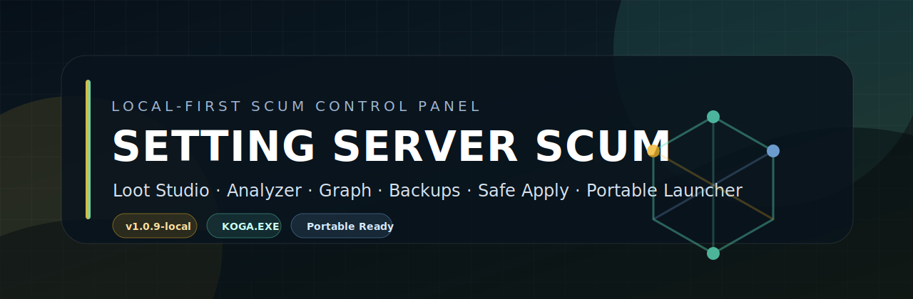

# SETTING SERVER SCUM



[](https://github.com/kogawz1997/scum-server-config-manager/releases/latest)
[](docs/RELEASE_QUALITY.md)
[](docs/COMPATIBILITY.md)
[](docs/COMPATIBILITY.md)
[](#credit)

Local-first control panel for SCUM server settings, loot files, backups, profiles, analyzer, graph view, and safe apply workflows. It is built for people who want to manage real `INI` and `JSON` server files without hand-editing everything blind.

โปรเจกต์นี้คือเครื่องมือจัดการไฟล์ตั้งค่าและระบบ loot ของ SCUM server แบบ local-first เปิดบนเครื่องตัวเอง แก้ไฟล์จริงได้ เห็น diff ก่อน save มี backup/restore และมีตัวช่วยตรวจ config ไม่ให้พังง่าย

## Current Release

- Latest: [`v1.0.9-local`](https://github.com/kogawz1997/scum-server-config-manager/releases/tag/v1.0.9-local)
- Portable zip: [`SETTING-SERVER-SCUM-v1.0.9-local.zip`](https://github.com/kogawz1997/scum-server-config-manager/releases/download/v1.0.9-local/SETTING-SERVER-SCUM-v1.0.9-local.zip)
- Release notes: [docs/releases/v1.0.9-local.md](docs/releases/v1.0.9-local.md)
- Project track: `P2.13 local-ready`
- Scope: local/portable app, not SaaS


## What It Does

SETTING SERVER SCUM turns a messy SCUM config folder into a safer working surface:

- Edit `ServerSettings.ini`, `GameUserSettings.ini`, `EconomyOverride.json`, `Nodes/*.json`, and `Spawners/*.json`
- Use Loot Studio instead of raw JSON for common item, probability, node, and spawner work
- Search across nodes, spawners, item names, refs, and file content
- Analyze loot balance, missing refs, unused nodes, frequent items, schema shape, and risk level
- View relationships as `Spawner -> Node -> Item`, with staged ref edit preview before apply
- Run dry-run, validation, diff preview, backup, rollback, and safe apply flows
- Save profiles, rotate configs, compare backups, and export support bundles
- Use curated item catalog metadata with icon-backed autocomplete, category, rarity, tags, and Thai/English names

## Portable Use

Recommended for normal users who do not want to run `npm` manually.

1. Open the [Latest Release](https://github.com/kogawz1997/scum-server-config-manager/releases/latest)
2. Download `SETTING-SERVER-SCUM-v1.0.9-local.zip`
3. Extract the zip into a clean folder
4. Double-click `Start SETTING SERVER SCUM.exe`
5. If Windows blocks the `.exe`, run `Start SETTING SERVER SCUM.cmd`
6. Open Dashboard and check Startup Doctor before editing real files

The launcher checks portable files, Node.js, dependencies, free port, startup log, and browser launch. If something is missing, it prints a `How to fix:` message instead of failing silently.

Required release scripts:

```powershell
npm run package:portable
npm run package:portable:smoke
npm run package:portable:zip-smoke
```

## Source Use

Requirements:

- Windows 10/11
- Node.js 18+
- SCUM server config folder, or the included sample workspace for testing

Run locally:

```powershell
npm install
npm start
```

Open:

```text
http://localhost:3000
```

Windows shortcut:

```text
start-local.cmd
```

## First-Time Setup

Go to `/settings` and set these paths before touching real server files:

- `SCUM config folder`: main `WindowsServer` config folder
- `Backup folder`: where backups should be written
- `Nodes folder`: optional override if nodes are not under the config root
- `Spawners folder`: optional override if spawners are not under the config root
- `Reload loot command`: only if you already have a tested reload script
- `Restart server command`: only if you already have a tested restart script

Typical shape:

```text
WindowsServer/
  ServerSettings.ini
  GameUserSettings.ini
  EconomyOverride.json
  Nodes/
  Spawners/
```

If your server uses a different `Nodes` or `Spawners` location, point those folders directly in App Settings.

## Main Screens

| Route | Purpose |
| --- | --- |
| `/dashboard` | Health overview, readiness checks, quick actions |
| `/settings` | App paths, backup folder, commands, first-run setup |
| `/server-settings` | Grouped server settings editor with human labels and True/False controls |
| `/core-files` | Core INI/JSON file editor |
| `/loot-studio` | Visual loot editor, catalog, simulator, bulk tools, raw JSON fallback |
| `/analyzer` | Loot/config balance, missing refs, unused nodes, advice |
| `/graph` | Spawner -> Node -> Item dependency view and staged ref edits |
| `/backups` | Backup, restore, compare, cleanup |
| `/profiles` | Snapshots, presets, rotation |
| `/help` | In-app usage guide |

## Safety Model

This app touches real server files, so the safety layer is part of the product:

- Diff preview before risky writes
- Backup before save/apply flows
- Dry-run support for safe apply and repair actions
- Transaction rollback for multi-file writes
- Atomic file write discipline in server-side stores
- Command sandbox for reload/restart actions
- Startup Doctor and Workspace Health Center
- Activity log plus structured operation logs at `logs/operations.jsonl`
- Support bundle export with private paths sanitized
- Release zip smoke test that extracts the generated zip before publishing

Direct rule: create a backup and pass readiness checks before editing production server configs.

## Release Quality

Before a local build is considered releasable:

```powershell
npm run release:quality
```

The quality gate runs:

- basic checks
- release file checks
- config/package roundtrip
- sample workspace smoke
- performance smoke
- docs link check
- changelog/version check
- portable build
- portable folder smoke
- portable zip extract smoke
- full unit, integration, UI, loot, settings, and backup regression tests

Latest verified release: `v1.0.9-local`

## More Documentation

- [Quick Start](docs/QUICK_START.md)
- [Thai Install Guide](docs/INSTALL_TH.md)
- [Daily Use](docs/DAILY_USE.md)
- [Recovery Guide](docs/RECOVERY_GUIDE.md)
- [Power User Guide](docs/POWER_USER_GUIDE.md)
- [Compatibility Matrix](docs/COMPATIBILITY.md)
- [Release Quality](docs/RELEASE_QUALITY.md)
- [Release Checklist](docs/RELEASE_CHECKLIST.md)
- [Project Structure](docs/PROJECT_STRUCTURE.md)
- [P2.13 Status](docs/P2_3_STATUS.md)
- [Changelog](CHANGELOG.md)

## Roadmap Boundary

This repository is now focused on the polished local/portable tool. SaaS, tenant hosting, auth, remote agents, and multi-server online control are intentionally outside this local release line.

Future work can still improve:

- full graph editor for every relationship type
- deeper runtime-accurate simulator
- larger curated item catalog
- more ready-made loot presets
- smarter goal-based balancing

## Credit

Project credit: `KOGA.EXE`

Built as a local-first SCUM server configuration manager with a bias toward readable UI, recoverable saves, and practical server-owner workflows.
